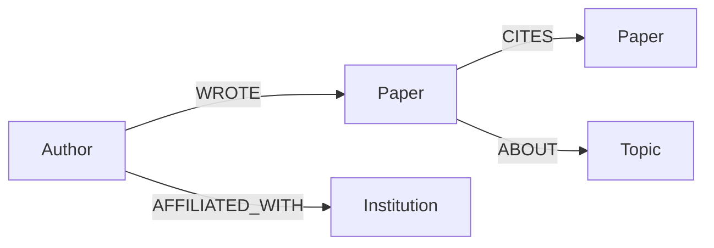

# Paper Trail

A research collaboration & citation graph explorer, backed by **CognoDB**.

Paper Trail lets you explore an academic community the way a researcher actually
thinks about it: not as rows in a table, but as a web of who-wrote-what, who-cites-whom,
and who-worked-with-whom. It's a small web app for browsing authors, tracing citation
chains, getting collaborator recommendations, and watching ideas spread across topics.

## Why a graph database?

A citation network is a graph by nature — authors write papers, papers cite other
papers, papers belong to topics, authors are affiliated with institutions. Every
interesting question about this domain is a question about *paths* and
*neighborhoods*, not aggregates over a single table:

- **"How is paper A connected to paper B?"** is a variable-length path query
  (`CITES*1..6`). In SQL this needs a recursive CTE that self-joins the same table
  an unknown number of times, and performance degrades as the chain gets longer
  because each hop is a separate join. In Cypher it's one pattern.
- **"Who should I collaborate with next?"** (people my co-authors have worked with,
  whom I haven't worked with yet) is a 2-hop friend-of-a-friend pattern with an
  anti-join. In SQL that's two self-joins on the authorship table plus a
  `NOT EXISTS` subquery — awkward to write and to keep readable. In Cypher it's a
  single `MATCH` clause with a `NOT (...)` predicate.
- **"How does an idea in one topic influence other topics?"** requires walking
  outward from a set of papers through citations and grouping by what's found —
  a traversal whose depth isn't known ahead of time. Modeling this in a relational
  schema means either a fixed number of hand-written joins (one per hop you
  anticipated needing) or application-side graph traversal in a loop of queries.
- Relationships carry their own properties here too (e.g. author order on a
  paper, "since" year on an affiliation) — first-class in a property graph,
  clunky as extra join-table columns in a relational model.

None of this is *impossible* in SQL — it's just working against the grain of the
storage model. A graph database stores the relationships as the primary citizens
they are, so these queries stay short, indexed, and fast as the traversal gets deeper.

## Data model



**Nodes**
| Label | Key properties |
|---|---|
| `Author` | `id`, `name`, `hIndex`, `joinedYear` |
| `Paper` | `id`, `title`, `year`, `venue` |
| `Topic` | `id`, `name` |
| `Institution` | `id`, `name`, `country` |

**Relationships**
| Type | From → To | Notes |
|---|---|---|
| `WROTE` | `Author → Paper` | one per author on a paper |
| `CITES` | `Paper → Paper` | forms a DAG (no cycles — citations only point to earlier work) |
| `ABOUT` | `Paper → Topic` | a paper can be about 1–2 topics |
| `AFFILIATED_WITH` | `Author → Institution` | has a `since` property |

Uniqueness constraints are created on `Author.id`, `Paper.id`, `Topic.id`, and
`Institution.id` by the seed script.

## The four showcase queries

All queries are parameterised through the official Neo4j driver — no string
concatenation of user input into Cypher anywhere in the codebase
(see `server/routes/*.js`).

**1. Citation trail (multi-hop, 1–6 hops)** — `GET /api/queries/citation-path`
```cypher
MATCH path = shortestPath((p1:Paper {id: $from})-[:CITES*1..6]->(p2:Paper {id: $to}))
RETURN [n IN nodes(path) | {id: n.id, title: n.title, year: n.year}] AS nodes,
       length(path) AS hops
```
Traces how one paper's ideas reached another, however many citations apart.

**2. Collaborator recommendations (the relational-unfriendly one)** — `GET /api/queries/recommend/:authorId`
```cypher
MATCH (me:Author {id: $authorId})-[:WROTE]->(:Paper)<-[:WROTE]-(collaborator:Author)
       -[:WROTE]->(:Paper)<-[:WROTE]-(candidate:Author)
WHERE candidate <> me
  AND NOT (me)-[:WROTE]->(:Paper)<-[:WROTE]-(candidate)
WITH candidate, count(DISTINCT collaborator) AS sharedCollaborators
...
```
"Friend of a friend, not yet a friend" — a two-hop join plus an anti-join, expressed
as a single graph pattern.

**3. Topic influence (multi-hop diffusion)** — `GET /api/queries/topic-influence/:topicId`
```cypher
MATCH (t:Topic {id: $topicId})<-[:ABOUT]-(origin:Paper)<-[:CITES*1..2]-(citing:Paper)-[:ABOUT]->(t2:Topic)
WHERE t2.id <> t.id
RETURN t2.id AS id, t2.name AS name, count(DISTINCT citing) AS citingPapers, ...
```
Starts from a topic, walks outward through citations, and reports which other
topics show up downstream — a proxy for "what fields does this idea spread into?"

**4. Shortest collaboration path** — `GET /api/queries/shortest-path`
```cypher
MATCH path = shortestPath((a1:Author {id: $from})-[:WROTE*..12]-(a2:Author {id: $to}))
RETURN [n IN nodes(path) | {...}] AS nodes, length(path) AS hops
```
The "how are these two researchers connected" query — alternates
Author → Paper → Author → Paper... until it reaches the target.

## Project structure

```
paper-trail/
├── server/
│   ├── index.js           Express app, startup connectivity check, error handling
│   ├── db.js               Neo4j driver setup (used against CognoDB's Bolt endpoint)
│   ├── dbGuard.js           Middleware returning a clean 503 when the DB is down
│   └── routes/
│       ├── authors.js       Author search + profile (papers, co-authors, network)
│       ├── papers.js        Paper search
│       └── queries.js       The four showcase Cypher queries
├── scripts/
│   └── seed.js              Generates & loads synthetic seed data (idempotent)
├── public/
│   ├── index.html
│   ├── styles.css
│   └── app.js               Vanilla JS frontend, no build step
├── .env.example
└── package.json
```

## Setup & run

### 1. Create a CognoDB instance
1. Sign up at [console.cognodb.com/signup](https://console.cognodb.com/signup) (no credit card needed for the free tier).
2. Create a free **c0** instance and pick a region — it provisions in under a minute.
3. Copy the connection URI (`bolt+s://<instance-id>.databases.cognodb.cloud`) and the
   generated password for user `cognodb` — **the password is shown once**, so save it now.

### 2. Configure environment variables
```bash
cp .env.example .env
# then edit .env and fill in COGNODB_URI and COGNODB_PASSWORD
```

### 3. Install dependencies
```bash
npm install
```

### 4. Seed the database
```bash
npm run seed
```
This wipes any existing data in the instance and loads ~12 institutions, 15 topics,
42 authors, 95 papers, and their `WROTE` / `CITES` / `ABOUT` / `AFFILIATED_WITH`
relationships using batched, parameterised `UNWIND` queries.

### 5. Run the app
```bash
npm start
```
Then open **http://localhost:3000**.

If CognoDB is unreachable (wrong credentials, instance paused, etc.), the server
still starts and serves the frontend; API calls return a clear
`{"error": "database_unreachable", ...}` response instead of crashing, and the UI
surfaces a banner at the top of the page.

## Deploying a hosted demo

Any Node-friendly free host works (Render, Railway, Fly.io, etc.). The app is a
single Express process serving both the API and the static frontend, so deployment
is just: set `COGNODB_URI`, `COGNODB_USER`, `COGNODB_PASSWORD` as environment
variables on the host, and run `npm start`. No separate frontend build step.

## Screenshots

_Add screenshots of each tab (Explore an Author, Citation Trail, Recommend
Collaborators, Topic Influence, Shortest Path) here after running the app against
your seeded instance._

## Notes on AI-assisted development

This codebase was scaffolded with AI assistance. Before submitting, walk through
each file and be ready to explain: why the queries are shaped the way they are,
why citations only point backward in time in the seed data (keeps the `CITES`
graph a DAG so multi-hop paths terminate), and the tradeoffs in the recommendation
scoring (`sharedCollaborators * 2 + sharedTopics`).
